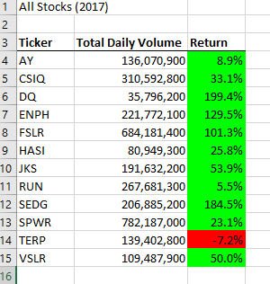

# Stocks-Analysis

## Overview of Project
This project analyzes thousands of green energy stocks from 2017 and 2018, through the utilization of Visual Basic for Applications (VBA), a programming language that interacts with excel by using macro code to automate analyses. 

### Purpose
The purpose of this project is to compare the stock performance between 2017 and 2018. execution times of the original script and the refactored script.

## Results
Performance of green stocks in 2017 and 2018.

### Comparison of 2017 and 2018 Stock Performance
The “Ticker” column references the stock symbol assigned to a stock. The “Total Daily Volume” column highlights how many shares were traded per day. The “Return” column indicates the change in price of an investment over time and is represented by a percentage change. A positive return represents a profit and is shown on the table in green, while a negative return represents an economic loss and is shown on the table in red. Through the use of conditional formatting in VBA, the cell color in the “Return” column is automatically updated to green or red, depending on the outcome of the return, which simplifies interpretation of the data and enhances analysis.

 

### Comparison of VBA Code Utilized to Run Analysis

To run the analysis, a detailed script of code had to be written in VBA. The original script was initially written and later refactored, with the intent to maximize the efficiency of the run time for the pop-up messages, after running analyses for 2017 and 2018. The original code included a nested for loop, which is essentially a loop inside of a loop, that tells the computer to repeat lines of code for as many loops outlined. In contrast, the refactored code was developed to loop through all the data one time in order to collect the same information as before. 

### Comparison of Code Performance 
The original and refactored code both include a script that calculates how long the code takes to compile results and outputs the elapsed time in a message box.

## Summary

**- What are the advantages or disadvantages of refactoring code?** 
The main advantage of refactoring code is that it maximizes overall efficiency, through streamlining code and therefore reducing run times. A major disadvantage of having to rewrite code which already works is that it may not always be evident as to how to effectively do this, without running in to numerous run time errors which involve debugging the code.

**- How do these pros and cons apply to refactoring the original VBA script?**
The pros and cons outlined above directly applied to refactoring the original VBA script. Although the code had to constantly be debugged in order to effectively run, ultimately the code was more organized and ran more efficiently, allowing proper analysis of the data.   

